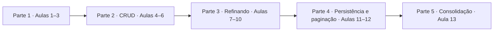

# Desenvolvimento Web II — APIs com Express e FastAPI

## 1. Objetivo do tutorial

Este material ensina a **construir uma API REST**, do zero até uma versão completa, em **13 aulas**.

Para isso, usamos **duas implementações diferentes da mesma API**:

* **Express** (Node.js / JavaScript);
* **FastAPI** (Python).

O objetivo **não** é dominar dois frameworks, e sim compreender o que é uma **API HTTP/REST** e
perceber que frameworks diferentes são apenas **formas diferentes de implementar o mesmo contrato**.

---

## 2. Ideia central: Express × FastAPI

> Express e FastAPI implementam a mesma API. A forma de programar muda, mas o contrato HTTP
> permanece.

Ao longo do curso construímos, lado a lado, a mesma API de produtos. O que o cliente (navegador,
Bruno, um aplicativo) envia e recebe será **praticamente idêntico** nas duas tecnologias; o que muda
é **como** cada framework gera esse comportamento. Isso deixa claro o que pertence ao **HTTP/REST**
(contrato) e o que pertence a cada **framework** (implementação).

> Durante o curso construiremos gradualmente uma única API de produtos. Express e FastAPI deverão
> atender ao mesmo contrato HTTP. Os detalhes desse contrato serão apresentados em cada aula, à
> medida que os conceitos forem introduzidos.

---

## 3. Como usar este tutorial

Cada aula 2–13 segue o mesmo ciclo:

1. **O que vamos aprender** — o conceito.
2. **Antes de programar** — o problema e o conceito HTTP envolvido.
3. **Express** — como o problema é resolvido (e como executar).
4. **FastAPI** — como o mesmo problema é resolvido (e como executar).
5. **Express × FastAPI** — o que é igual, o que difere e por quê.
6. **Contrato HTTP** — o que o cliente vê.
7. **Pratique no Bruno** — teste a API.
8. **O que observar** — pontos importantes (apenas quando necessário).

O tutorial **explica o código** — ele **não duplica** os arquivos inteiros. Você deve:

1. ler o tutorial;
2. abrir o arquivo da aula no repositório;
3. executar o servidor;
4. abrir o Bruno;
5. executar/testar;
6. comparar as duas implementações.

Em cada aula, o mesmo conceito é trabalhado primeiro no Express e depois no FastAPI, seguido da
comparação e da prática no Bruno.

---

## 4. Pré-requisitos

Você precisa ter instalado:

- **Node.js** (versão 18 ou superior) — para o Express;
- **npm** — vem junto com o Node;
- **Python** (versão 3.10 ou superior) — para o FastAPI;
- **pip** — vem junto com o Python;
- **Bruno** (aplicação de desktop) — cliente HTTP para testar a API.

Os exemplos são independentes entre si: **cada arquivo de aula é um servidor completo**.

---

## 5. Onde está o código (repos externos)

> **Este repositório (`desweb2`) contém principalmente o material didático.** O **código-fonte** das
> aulas **não fica aqui** — ele está nos repositórios específicos de cada tecnologia:
>
> - **Express (Node.js / JavaScript):** https://github.com/marrcandre/express-bsi4
> - **FastAPI (Python):** https://github.com/marrcandre/fastapi-bsi4/tree/main

Cada repositório possui **seu próprio README**, com as instruções específicas para:

- clonar o projeto;
- instalar as dependências;
- configurar o ambiente;
- executar o servidor;
- navegar entre as aulas.

Siga essas instruções dentro de cada repositório. Este tutorial **não replica** os passos de
instalação: ele explica os **conceitos** e aponta para os arquivos de aula de cada repositório.

| Repositório   | Tecnologia       | Arquivos de aula         | Porta | Coleção Bruno      |
| ------------- | ---------------- | ------------------------ | ----- | ------------------ |
| `express-bsi4` | Node.js+ Express | `aula2_*.js` … `aula13_*.js` | 3000  | `http/express/`    |
| `fastapi-bsi4` | Python + FastAPI | `aula2_*.py` … `aula13_*.py` | 8000  | `http/fastapi/`    |

Os arquivos são **progressivos**: cada aula mantém tudo da anterior e acrescenta um conceito.
A aula de cada conceito corresponde a um arquivo com o mesmo nome nas duas tecnologias (`.js` no
Express, `.py` no FastAPI). Veja a lista completa nos READMEs de cada repositório. O dataset
`produtos.json` é usado **a partir da Aula 11**.

---

## 6. Bruno — cliente HTTP do curso

### Por que usamos o Bruno

O **Bruno** é o cliente HTTP oficial da disciplina. Ele permite **guardar as requisições junto com o
código** e **versioná-las no repositório**. Assim, cada aula tem uma coleção de requisições que
exercita exatamente o que foi construído.

**Executar o servidor ≠ testar a API.** O servidor (a aula que você inicia com `node`/`uvicorn`)
**processa** as requisições e devolve respostas. O **Bruno** é a ferramenta que **envia** essas
requisições para você observar o que a API responde. Um depende do outro: sem o servidor rodando, o
Bruno não tem para quem enviar a requisição (retornaria erro de conexão).

### Instalação

> Instale o Bruno no seu sistema e abra o aplicativo. O **uso** em si será construído aos poucos na
> Aula 1 e nas coleções das Aulas 2–13.

<details>
<summary><strong>Ubuntu / Debian (APT)</strong></summary>

Adicione o repositório oficial do Bruno e instale:

```bash
sudo mkdir -p /etc/apt/keyrings
sudo apt update && sudo apt install gpg curl
curl -fsSL "https://keyserver.ubuntu.com/pks/lookup?op=get&search=0x9FA6017ECABE0266" \
  | gpg --dearmor \
  | sudo tee /etc/apt/keyrings/bruno.gpg > /dev/null
sudo chmod 644 /etc/apt/keyrings/bruno.gpg
echo "deb [arch=amd64 signed-by=/etc/apt/keyrings/bruno.gpg] http://debian.usebruno.com/ bruno stable" \
  | sudo tee /etc/apt/sources.list.d/bruno.list
sudo apt update && sudo apt install bruno
```

</details>

<details>
<summary><strong>Manjaro Linux (Snap)</strong></summary>

No Manjaro, o Bruno pode ser instalado via **Snap**:

```bash
sudo pacman -S snapd
sudo systemctl enable --now snapd.socket
sudo ln -s /var/lib/snapd/snap /snap        # suporte a snap "classic"
sudo snap install bruno
```

</details>

<details>
<summary><strong>Windows (winget / Chocolatey / Scoop)</strong></summary>

Use um dos gerenciadores de pacote:

```bash
winget install Bruno.Bruno        # mais simples no Windows 10/11
# ou
choco install bruno               # via Chocolatey
# ou
scoop bucket add extras && scoop install bruno   # via Scoop
```

Também é possível baixar o instalador (`.exe`/`.msi`) na página oficial
https://www.usebruno.com/downloads.

</details>

### Estratégia pedagógica do Bruno

- **Aula 1:** **não** entregamos uma coleção pronta. O aluno cria **manualmente** suas primeiras
  requisições (para APIs públicas), para entender que uma requisição HTTP pode ser construída à mão.
- **Aulas 2–13:** usamos as **coleções oficiais já preparadas** nos repositórios
  (`http/express/` e `http/fastapi/`) para testar **sistematicamente** a API desenvolvida em cada
  aula.

Essa diferença é intencional: primeiro você **compreende a requisição**, depois passa a usar
**coleções organizadas**.

> Nas Aulas 2–13, para executar, basta: **(1)** abrir a coleção `http/express/` ou `http/fastapi/`,
> **(2)** selecionar o ambiente `Local` (que define `baseUrl` para a porta correta) e **(3)** executar
> as requisições da pasta da aula. As requisições levam pequenas asserções (`assert`) que validam o
> status e o formato da resposta.

---

## 7. Visão geral das 13 aulas

| Aula | Conceito             | Parte                             |
| ---- | -------------------- | -------------------------------- |
| 01   | Fundamentos de APIs  | Parte 1 — Fundamentos e primeiros endpoints |
| 02   | GET de coleção       | Parte 1                          |
| 03   | GET por ID           | Parte 1                          |
| 04   | POST                 | Parte 2 — CRUD                   |
| 05   | PUT                  | Parte 2                          |
| 06   | DELETE               | Parte 2                          |
| 07   | Validação            | Parte 3 — Refinando a API        |
| 08   | Filtros              | Parte 3                          |
| 09   | Busca                | Parte 3                          |
| 10   | Ordenação            | Parte 3                          |
| 11   | Persistência em JSON | Parte 4 — Persistência e paginação |
| 12   | Paginação            | Parte 4                          |
| 13   | API completa         | Parte 5 — Consolidação           |

---

# Parte 1 — Fundamentos e primeiros endpoints

---

## Aula 01 — Fundamentos de APIs

> **Objetivo desta aula (~90 min):** ambientação e fundamentos. Os detalhes de cada conceito serão
> aprofundados na aula em que aparecerem. Aqui você só precisa entender o **panorama** da disciplina.

### 1. O que é uma API

**API** (*Application Programming Interface*) é um conjunto de regras que definem **como um sistema
pode conversar com outro**. Uma **API web** é acessível pela internet, normalmente usando o protocolo
**HTTP**.

Quando você abre um aplicativo de clima, ele consulta uma API de um serviço meteorológico. Quando um
site calcula o frete, ele consulta a API de uma transportadora. Em Desenvolvimento Web II, nosso
objetivo é **criar** esse tipo de serviço — uma API que devolve dados de produtos.

### 2. Cliente, servidor, requisição e resposta

- **Cliente** — quem faz a requisição (navegador, aplicativo, ou o próprio Bruno).
- **Servidor** — quem recebe, processa e devolve a resposta (no nosso caso, uma API).
- **Requisição (request)** — o que o cliente envia: método, URL e, às vezes, um corpo.
- **Resposta (response)** — o que o servidor devolve: um status e, em geral, um corpo JSON.

```text
Cliente
   │
   │ HTTP Request (método + URL + corpo)
   ▼
Servidor / API
   │
   │ HTTP Response (status + corpo)
   ▼
Cliente
```

Esse ciclo "pedido → resposta" é a base de tudo que faremos no curso.

### 3. HTTP

O **HTTP** é o protocolo usado para essa comunicação. Uma requisição HTTP é composta, basicamente,
por:

- **método** — a intenção da operação;
- **URL** — para onde a requisição vai;
- **parâmetros** — dados extras na URL (ex.: `/api/produtos/1`, `?search=mouse`);
- **headers** — informações de controle (breve agora; usaremos pouco no curso);
- **corpo (body)** — os dados enviados (em POST/PUT).

O servidor responde com um **status code** (código do resultado) e, em geral, um corpo. Os principais
deste curso:

| Código | Significado                  | Quando aparece |
| ------ | ---------------------------- | -------------- |
| `200`  | Sucesso (leitura/atualização)| Aulas 2–5      |
| `201`  | Recurso criado                | Aula 4         |
| `204`  | Sucesso sem corpo (exclusão) | Aula 6         |
| `400`  | Requisição inválida           | Aula 7         |
| `404`  | Recurso não encontrado        | Aula 3         |
| `500`  | Erro interno do servidor      | —              |

Os métodos principais do curso são:

- **GET** — ler dados (Aulas 2 e 3);
- **POST** — criar (Aula 4);
- **PUT** — atualizar por completo (Aula 5);
- **DELETE** — excluir (Aula 6).

> **PATCH** representa atualização **parcial** e faz parte do REST. Nesta sequência usamos o **PUT**
> para atualização completa; o PATCH fica para depois.

### 4. JSON

**JSON** é o formato de dados mais usado em APIs web. Permite representar objetos e listas:

```json
{ "id": 1, "nome": "Notebook", "preco": 3500 }
```

```json
[ { "id": 1, "nome": "Notebook", "preco": 3500 },
  { "id": 2, "nome": "Mouse", "preco": 80 } ]
```

No curso, **JSON é o formato de dados das nossas APIs**: a API recebe e devolve JSON.

### 5. REST — ideia principal

**REST** é um conjunto de boas práticas para organizar APIs web. As principais ideias:

- os dados são organizados em **recursos**;
- cada recurso é identificado por uma **URL** (ex.: `/api/produtos/1`);
- as **operações** sobre o recurso são feitas com **métodos HTTP** (GET, POST, PUT, DELETE);
- o recurso é **representado** em um formato (em geral, **JSON**).

Os detalhes serão ensinados nas próximas aulas, **não antecipe** nada disso.

### 6. Framework ≠ protocolo

- **HTTP** é o **protocolo**: define como cliente e servidor conversam (métodos, status, URLs).
- **REST** é uma **forma de organizar** APIs sobre HTTP.
- **Express** é um **framework/ecossistema** para Node.js (JavaScript).
- **FastAPI** é um **framework** para Python.

Os dois frameworks podem implementar o **mesmo contrato HTTP** — mesmo endpoint, mesmos métodos,
mesmas respostas:

```text
                CONTRATO HTTP
       /api/produtos/ + métodos + respostas
                        │
             ┌──────────┴──────────┐
             ▼                     ▼
          Express               FastAPI
          Node.js                Python
             │                     │
             └──────────┬──────────┘
                        ▼
                  mesmo cliente
```

> **O framework muda a forma de implementar. O contrato HTTP permanece.**

### 7. Conhecendo os repositórios

O **código-fonte** das aulas fica nos repositórios de cada tecnologia (o `desweb2` guarda o material
didático). Os links oficiais:

- **Express:** https://github.com/marrcandre/express-bsi4
- **FastAPI:** https://github.com/marrcandre/fastapi-bsi4

Cada um tem seu README com clone, instalação e execução. No `express-bsi4/` estão `aula2_*.js` a
`aula13_*.js` (porta 3000); no `fastapi-bsi4/`, `aula2_*.py` a `aula13_*.py` (porta 8000). Cada
arquivo é um servidor completo e progressivo.

### 8. Preparando o Bruno

Instale e abra o **Bruno** (veja a seção 6 com as instruções por sistema). No Bruno, uma **coleção**
é um conjunto de **requisições** organizadas. As requisições podem usar um **ambiente** com a
**URL base** (como `{{baseUrl}}`), e cada uma define **método**, **URL**, **parâmetros**, **corpo** e
mostra **status** e **resposta**.

### 9. Primeira prática no Bruno

> **Importante:** aqui o aluno cria as requisições **manualmente**. Não usamos coleção pronta nesta
> aula. O objetivo é entender que uma requisição HTTP pode ser construída à mão.

Vamos consultar duas **APIs públicas** e observar o formato JSON:

**ViaCEP**

```
GET https://viacep.com.br/ws/89201000/json/
```

**Cotação do dólar**

```
GET https://economia.awesomeapi.com.br/json/last/USD-BRL
```

No Bruno, crie uma requisição `GET` para cada URL acima, execute e observe:

- o **método** usado;
- a **URL** (para onde foi enviado);
- o **status** retornado;
- o **corpo** (o que o servidor respondeu);
- o **JSON** e os **campos** retornados.

### 10. O que vem nas próximas aulas

O curso está organizado em **cinco partes**:

| Parte | Tema                                  | Aulas |
| ----- | ------------------------------------- | ----- |
| Parte 1 | Fundamentos e primeiros endpoints   | 1–3   |
| Parte 2 | CRUD                                 | 4–6   |
| Parte 3 | Refinando a API (validação, filtros, busca, ordenação) | 7–10 |
| Parte 4 | Persistência e paginação             | 11–12 |
| Parte 5 | Consolidação                         | 13    |



Começamos devolvendo uma lista fixa e terminamos com uma **API completa com CRUD, validação,
filtros, busca, ordenação, persistência e paginação**. Nas Aulas 2–13, usaremos as **coleções
oficiais** do Bruno que já acompanham os repositórios.

---

## Aula 02 — GET de coleção

### O que vamos aprender

Como fazer a API responder a uma requisição **`GET`** com uma **lista (coleção)** de produtos. É o
primeiro endpoint da nossa API.

### Antes de programar

Precisamos escutar o `GET` em um URL e devolver um **JSON com um array de produtos**. As Aulas 2–10
usam **5 produtos em memória** definidos no próprio código — sem banco, sem arquivo, sem
`produtos.json`.

### Express

- **Arquivo:** `express-bsi4/aula2_api_basica_get_colecao.js`

```js
app.get('/api/produtos/', (req, res) => {
  res.json([ ... ]);   // array de 5 produtos
});
```

`app.get('/rota', manipulador)` registra o que fazer em uma requisição `GET`. O manipulador recebe
`req` (requisição) e `res` (resposta); `res.json(...)` devolve o corpo em JSON.

**Executar:**
```bash
node aula2_api_basica_get_colecao.js
```
Servidor na porta `3000`. Acesse `http://localhost:3000/api/produtos/`.

### FastAPI

- **Arquivo:** `fastapi-bsi4/aula2_api_basica_get_colecao.py`

```python
@app.get("/api/produtos/")
def listar_produtos():
    return produtos   # lista de 5 produtos
```

O decorador `@app.get(...)` registra a rota. A função **retorna** o valor (lista de dicts), e o
FastAPI converge para JSON automaticamente.

**Executar:**
```bash
uvicorn aula2_api_basica_get_colecao:app --reload
```
Servidor na porta `8000`. Documentação automática em `http://localhost:8000/docs`.

### Express × FastAPI

| Conceito            | Express                | FastAPI                 |
| ------------------- | ---------------------- | ----------------------- |
| Definir a rota GET  | `app.get('/api/produtos/')` | `@app.get('/api/produtos/')` |
| Responder JSON      | `res.json(produtos)`   | `return produtos`        |
| Objeto da requisição| `req`, `res` (explícitos) | parâmetros da função (declarativos) |
| Documentação        | não automática          | `/docs` automática       |

**O que pertence ao HTTP:** a URL `/api/produtos/`, o método `GET`, o status `200` e o corpo JSON.

**O que pertence ao framework:** a sintaxe de registrar rota e enviar resposta.

**Por que diferente?** O Express é mais explícito (você manipula `req`/`res`). O FastAPI é mais
declarativo: você chama a função e devolve um valor.

### Contrato HTTP

| Método | URL                  | Status | Resposta                |
| ------ | -------------------- | ------ | ----------------------- |
| GET    | `/api/produtos/`      | 200    | array JSON de 5 produtos |

### Pratique no Bruno

> **Agora é sua vez.** Abra a coleção `http/express/` (e depois `http/fastapi/`), selecione o
> ambiente `Local`, inicie a Aula 2 e execute a requisição **Aula 02 → 01 - listar todos**. Observe
> método, URL, status `200` e o array de produtos.

Compare: a mesma requisição nas duas tecnologias devolve o **mesmo tipo** de resposta.

### O que observar

- A rota de coleção usa o **plural** e termina com **barra final** (`/api/produtos/`).
- O corpo da resposta é um **array**, pois é uma **coleção**.

---

## Aula 03 — GET por ID

### O que vamos aprender

Buscar um **único produto** pelo `id`, usando **parâmetro de rota**, e tratar o caso de não existência
com **`404`**.

### Antes de programar

Além de listar tudo, queremos pedir **um** produto: `GET /api/produtos/1/`. O `1` é um **parâmetro
de rota** (parte dinâmica da URL). Se o produto não existir, o HTTP tem um status para isso:
**`404 Not Found`**.

### Express

- **Arquivo:** `express-bsi4/aula3_get_por_id.js`

```js
app.get('/api/produtos/:id/', (req, res) => {
  const produto = produtos.find(p => p.id === parseInt(req.params.id));
  if (!produto) return res.status(404).json({ detail: "Produto não encontrado." });
  res.json(produto);
});
```

- `:id` na rota vira um parâmetro acessível em `req.params.id`.
- `parseInt(...)` converte o valor da URL (string) em número.
- Se não achar, `res.status(404).json({ detail: ... })`.
- Aqui também os dados são os **5 produtos em memória**.

### FastAPI

- **Arquivo:** `fastapi-bsi4/aula3_get_por_id.py`

```python
@app.get("/api/produtos/{id}/")
def buscar_produto_por_id(id: int):
    for produto in produtos:
        if produto["id"] == id:
            return produto
    raise HTTPException(status_code=404, detail="Produto não encontrado.")
```

- `{id}` na URL vira o parâmetro tipado `id: int` da função.
- O FastAPI converte o valor para `int` automaticamente (você declara o tipo).
- Para inexistente, `HTTPException(status_code=404, ...)`.

### Express × FastAPI

| Conceito         | Express                    | FastAPI                         |
| ---------------- | -------------------------- | ------------------------------- |
| Parâmetro na rota| `:id` e `req.params.id`    | `{id}` e parâmetro `id`         |
| Conversão de tipo| manual (`parseInt`)        | automática via `id: int`        |
| Erro 404         | `res.status(404).json(detail)` | `raise HTTPException(404, detail=...)` |

**Igual:** o contrato `GET /api/produtos/{id}/` → `404` quando não existe, com `detail`.

**Diferente:** no Express o tipo é convertido **manualmente**; no FastAPI o tipo é **declarado** e o
framework converte.

> A operação é a mesma (leitura de um recurso por ID). A declaração é que muda.

### Contrato HTTP

| Requisição | URL                    | Sucesso | Não encontrado     |
| ---------- | -----------------------| ------- | ------------------ |
| GET        | `/api/produtos/{id}/`   | 200 + produto | 404 + `detail` |

### Pratique no Bruno

> Abra a coleção (Express e FastAPI), ambiente `Local`. Na pasta **Aula 03**, execute:
> **01 – listar todos**, **02 – buscar por id existente** (200) e **03 – buscar por id inexistente**
> (404). Observe o id na URL e a resposta em cada caso.

### O que observar

- **Parâmetro de rota** (`/produtos/1`) é diferente de **query param** (`/produtos?search=...`):
  a rota identifica um **recurso**; o query faz **filtros/busca** (veremos na Aula 8).
- O status muda de `200` para `404` quando o recurso não existe.

---

# Parte 2 — CRUD

---

## Aula 04 — POST (criar)

### O que vamos aprender

Enviar o **corpo** da requisição para **criar** um novo produto (`POST`), com status **`201 Create`**.

### Antes de programar

Agora o cliente envia dados ao servidor (**corpo da requisição**): `nome` e `preco`. O servidor cria o
produto, gera um novo `id` e devolve o produto com status **`201 Create`**.

### Express

- **Arquivo:** `express-bsi4/aula4_post.js`

```js
app.post('/api/produtos/', (req, res) => {
  const { nome, preco } = req.body;
  const novoId = produtos.length ? Math.max(...produtos.map(p => p.id)) + 1 : 1;
  const novoProduto = { id: novoId, nome, preco };
  produtos.push(novoProduto);
  res.status(201).json(novoProduto);
});
```

- `app.use(express.json())` é necessário para o Express ler o corpo JSON em `req.body`.
- `req.body` traz os dados enviados.
- Gera um `id` novo com base no maior id existente.
- `res.status(201).json(...)` devolve o produto com status **201**.

**Executar:** `node aula4_post.js` — porta `3000`.

### FastAPI

- **Arquivo:** `fastapi-bsi4/aula4_post.py`

```python
class ProdutoInput(BaseModel):
    nome: str
    preco: float

@app.post("/api/produtos/", status_code=201)
def criar_produto(produto: ProdutoInput):
    novo_id = max(item["id"] for item in produtos) + 1
    novo_produto = {"id": novo_id, "nome": produto.nome, "preco": produto.preco}
    produtos.append(novo_produto)
    return novo_produto
```

- `ProdutoInput(BaseModel)` é o **modelo Pydantic** que representa o corpo esperado.
- O parâmetro tipado `produto: ProdutoInput` — o FastAPI lê e valida estruturas do corpo.
- `status_code=201` fixa o status de sucesso.

### Express × FastAPI

| Conceito       | Express                         | FastAPI                      |
| -------------- | ------------------------------- | ---------------------------- |
| Corpo          | `req.body` (com `express.json()`) | parâmetro tipado (`ProdutoInput`) |
| Modelo do corpo| não há (objeto bruto)           | Pydantic `BaseModel`         |
| Status         | `res.status(201).json(...)`     | `status_code=201`          |

**Igual:** o cliente envia o mesmo JSON e recebe o produto criado com um `id`.

**Diferente:** no Express o corpo é **lido manualmente**; no FastAPI ele é **declarado** como parser
tipado e validado. A estrutura do corpo já gera **documentação** em `/docs`.

### Contrato HTTP

| Requisição | URL                  | Corpo                    | Sucesso | Formato |
| ---------- | -------------------- | ----------------------- | ------- | ------- |
| POST       | `/api/produtos/`      | `{"nome": "...", "preco": ...}` | 201 + produto criado | produto criado em JSON |

### Pratique no Bruno

> Na pasta **Aula 04**, execute **01 – listar todos** (antes), **02 – criar produto** (com o corpo
> JSON no POST, `201`) e **03 – buscar criado** (200). Observe que o corpo é **enviado** no POST.

### O que observar

- GET **não** leva corpo; POST **leva**. Isso distingue "ler" e "criar".
- O `201` é para **criação**; o `200` para leitura/atualização.
- O id é gerado pelo servidor — o cliente não precisa escolher.

---

## Aula 05 — PUT (atualizar)

### O que vamos aprender

**Atualizar por completo** um produto existente com `PUT /api/produtos/{id}/`.

### Antes de programar

Depois de criar, é preciso **alterar**. O `PUT` envia os dados no corpo e substitui o recurso naquele
id. Como o `PUT` é **atualização completa**, o corpo deve trazer **todos** os campos (`nome` e
`preco`). Se o id não existir, `404`.

### Express

- **Arquivo:** `express-bsi4/aula5_put.js`

```js
app.put('/api/produtos/:id/', (req, res) => {
  const index = produtos.findIndex(p => p.id === parseInt(req.params.id));
  if (index === -1) return res.status(404).json({ detail: "Produto não encontrado." });
  const { nome, preco } = req.body;
  produtos[index] = { id: parseInt(req.params.id), nome, preco };
  res.json(produtos[index]);
});
```

### FastAPI

- **Arquivo:** `fastapi-bsi4/aula5_put.py`

```python
@app.put("/api/produtos/{id}/")
def atualizar_produto(id: int, produto: ProdutoInput):
    for index, item in enumerate(produtos):
        if item["id"] == id:
            produtos[index] = {"id": id, "nome": produto.nome, "preco": produto.preco}
            return produtos[index]
    raise HTTPException(status_code=404, detail="Produto não encontrado.")
```

### Express × FastAPI

| Conceito         | Express                    | FastAPI                         |
| ---------------- | -------------------------- | ------------------------------- |
| Parâmetro na rota| `:id` + `req.params.id`    | `{id}` + `id: int`              |
| Corpo            | `req.body`                 | parâmetro tipado `ProdutoInput` |
| Localizar        | `findIndex(...)`           | `enumerate(produtos)`           |
| Não encontrado   | `res.status(404).json(detail)` | `raise HTTPException(404, detail=...)` |

**Igual:** o contrato é `PUT /api/produtos/{id}/` com o corpo completo no JSON e `404` quando o id
não existe.

**Diferente:** o Express localiza e substitui **manualmente** (índice no array); o FastAPI percorre
com `enumerate` e substitui de forma semelhante, mas com **tipos declarados** na assinatura.

**Por que diferente?** São as abstrações de cada framework: um expõe `req`/`res`; o outro usa
assinatura de função tipada. Em ambos, a **responsabilidade do HTTP** é a mesma: rota, método, corpo,
status.

> O `PUT` é **atualização completa**: o corpo deve trazer `nome` e `preco`.

### Contrato HTTP

| Requisição | Método | URL                   | Corpo | Sucesso | Inexistente |
| ---------- | ------ | --------------------- | ----- | ------- | ----------- |
| PUT        | PUT    | `/api/produtos/{id}/` | `nome`, `preco` | 200 + atualizado | 404 + `detail` |

### Pratique no Bruno

> Pasta **Aula 05**: execute **01 – listar**, **02 – atualizar produto** (corpo novo, `200`),
> **03 – conferir atualização** e **04 – atualizar id inexistente** (`404`).

### O que observar

- O `PUT` é **idempotente**: repetir o mesmo `PUT` produz o mesmo resultado.
- Criar (`POST`) e atualizar (`PUT`): o segundo **exige um id** na rota.

---

## Aula 06 — DELETE (remover)

### O que vamos aprender

Remover um produto com `DELETE /api/produtos/{id}/`, retornando **`204 No Content`** (sucesso sem
corpo).

### Antes de programar

O `DELETE` não precisa de corpo. Após excluir, o comum é devolver **`204 No Content`** (sem corpo) ou
**`404`** se o recurso não existir.

### Express

- **Arquivo:** `express-bsi4/aula6_delete.js`

```js
app.delete('/api/produtos/:id/', (req, res) => {
  const index = produtos.findIndex(p => p.id === parseInt(req.params.id));
  if (index === -1) return res.status(404).json({ detail: "Produto não encontrado." });
  produtos.splice(index, 1);
  res.status(204).end();
});
```

### FastAPI

- **Arquivo:** `fastapi-bsi4/aula6_delete.py`

```python
@app.delete("/api/produtos/{id}/", status_code=204)
def remover_produto(id: int):
    for index, item in enumerate(produtos):
        if item["id"] == id:
            produtos.pop(index)
            return
    raise HTTPException(status_code=404, detail="Produto não encontrado.")
```

### Express × FastAPI

| Conceito        | Express                    | FastAPI                         |
| --------------- | -------------------------- | ------------------------------- |
| Remover         | `splice(index, 1)`         | `pop(index)`                    |
| Resposta 204    | `res.status(204).end()`    | `status_code=204` na rota + `return` |
| Não encontrado  | `res.status(404).json(detail)` | `raise HTTPException(404, detail=...)` |

**Igual:** o contrato é `DELETE /api/produtos/{id}/` → `204` (sem corpo) quando remove e `404`
quando o id não existe.

**Diferente:** o `204` exige um cuidado de cada framework — no Express o status é enviado e a
resposta **encerrada sem corpo**; no FastAPI o `status_code=204` é declarado na rota e a função
**não devolve corpo**.

**Por que diferente?** O Express controla a resposta via `res`; o FastAPI declara o status na rota. A
**responsabilidade do HTTP** é a mesma: `204 No Content` significa "deu certo, sem corpo".

### Contrato HTTP

| Requisição | Método | URL                   | Sucesso              | Inexistente |
| ---------- | ------ | --------------------- | -------------------- | ----------- |
| DELETE     | DELETE | `/api/produtos/{id}/` | 204 (sem corpo)      | 404 + `detail` |

### Pratique no Bruno

> Pasta **Aula 06**: **01 – listar**, **02 – remover produto** (`204`), **03 – buscar removido**
> (`404`), **04 – remover de novo** (também `404`).

### O que observar

- `204` **não tem corpo** (não é `200` com corpo).
- Excluir é **idempotente**: após remover, uma nova chamada ao mesmo id devolve `404`.

---

# Parte 3 — Refinando a API

---

## Aula 07 — Validação

### O que vamos aprender

**Validar** os dados recebidos para que a API não aceite valores inválidos, devolvendo **`400`** com
`detail`.

### Antes de programar

Até aqui, um `POST` com dados inconsistentes criava um produto. Vamos aplicar regras:

- `nome`: obrigatório, string, com `trim`, entre **2 e 100** caracteres.
- `preco`: obrigatório, numérico, **> 0**, no máximo **2 casas decimais**.

Erros devolvidos com **`400 Bad Request`** e `detail` por campo.

### Express

- **Arquivo:** `express-bsi4/aula7_validacao.js`

`validarProduto({ nome, preco })` devolve um objeto de erros; vazio = válido.

```js
function validarProduto({ nome, preco }) {
  const erros = {};
  if (nome === undefined) erros.nome = "O campo é obrigatório.";
  else if (typeof nome !== "string") erros.nome = "O campo deve ser uma string.";
  else {
    const n = nome.trim();
    if (n === "") erros.nome = "O campo não pode ser vazio.";
    else if (n.length < 2 || n.length > 100) erros.nome = "O nome deve possuir entre 2 e 100 caracteres.";
  }
  // ... validações de preco ...
  return erros;
}
```

No POST e no PUT, se houver erros: `res.status(400).json({ detail: erros })`.

### FastAPI

- **Arquivo:** `fastapi-bsi4/aula7_validacao.py`

Aqui a validação também é **explícita** (igual ao Express), para facilitar a comparação.

```python
def validar_produto(nome, preco):
    erros = {}
    if nome is None:
        erros["nome"] = "O campo é obrigatório."
    elif not isinstance(nome, str):
        erros["nome"] = "O campo deve ser uma string."
    else:
        n = nome.strip()
        if n == "":
            erros["nome"] = "O campo não pode ser vazio."
        elif len(n) < 2 or len(n) > 100:
            erros["nome"] = "O nome deve possuir entre 2 e 100 caracteres."
    # ... preco ...
    return erros
```

No POST/PUT, se `erros` não estiver vazio: `raise HTTPException(400, detail=erros)`.

### Express × FastAPI

| Conceito     | Express        | FastAPI             |
| ------------ | -------------- | ------------------- |
| Validação    | função manual `validarProduto` | função manual `validar_produto` |
| Erro 400     | `res.status(400).json({ detail })` | `raise HTTPException(400, detail=...)` |

**Atenção didática:** nesta aula os dois fazem a validação **manualmente**, com lógica semelhante. A
diferença de implementação está mais em **como retornam o `400`**. (O Pydantic, usado pelo FastAPI,
tem recursos mais "declarativos", mas mantivemos a versão explícita para visualizar a comparação.)

> Mesmo com implementações parecidas, o **contrato** é o mesmo: `400` + `detail` por campo.

### Contrato HTTP

| Caso | Status | Resposta |
| ---- | ------ | -------- |
| Dados válidos        | `201` / `200` | produto |
| `nome` inválido      | `400` | `detail: { "nome": "..." }` |
| `preco` inválido     | `400` | `detail: { "preco": "..." }` |

### Pratique no Bruno

> Pasta **Aula 07** — teste casos de erro: **02 nome vazio**, **03 nome curto**, **04 preco zero**,
> **05 preco com 3 casas**, e casos de sucesso (**06 put inválido**, **07 post válido**). Observe o
> formato `detail` e o status `400`.

---

## Aula 08 — Filtros

### O que vamos aprender

Filtrar a coleção por faixa de preço com **query params** (`preco_minimo`, `preco_maximo`).

### Antes de programar

Queremos `GET /api/produtos/?preco_minimo=100&preco_maximo=1000` devolvendo só os produtos entre
`100` e `1000`. Os valores chegam através da **query string**.

### Express

- **Arquivo:** `express-bsi4/aula8_filtros.js`

```js
const { preco_minimo, preco_maximo } = req.query;
let resultado = [...produtos];              // cópia
if (preco_minimo !== undefined && preco_minimo !== "")
  resultado = resultado.filter(p => p.preco >= Number(preco_minimo));
if (preco_maximo !== undefined && preco_maximo !== "")
  resultado = resultado.filter(p => p.preco <= Number(preco_maximo));
res.json(resultado);
```

- `req.query` traz os query params.
- `filter()` devolve uma nova lista com os que atendem, sobre uma **cópia**.

### FastAPI

- **Arquivo:** `fastapi-bsi4/aula8_filtros.py`

```python
@app.get("/api/produtos/")
def listar_produtos(preco_minimo: str | None = None, preco_maximo: str | None = None):
    resultado = produtos
    if preco_minimo is not None:
        resultado = [p for p in resultado if p["preco"] >= preco_minimo]
    if preco_maximo is not None:
        resultado = [p for p in resultado if p["preco"] <= preco_maximo]
    return resultado
```

- Os parâmetros da função **viram query params** automaticamente.
- `preco_minimo: str | None` é `None` quando ausente.

### Express × FastAPI

| Conceito    | Express                  | FastAPI                  |
| ----------- | ------------------------ | ------------------------ |
| Leitura     | `req.query.preco_minimo` | parâmetro `preco_minimo` |
| Filtro      | `.filter(p => ...)`      | list comprehension        |
| Ausência    | `undefined` / `""`       | `None`                    |

**Contrato:** o que o cliente envia (`?preco_minimo=...`, `?preco_maximo=...`) e a resposta (array
filtrada) são os mesmos.

### Contrato HTTP

| Query params          | Comportamento        |
| --------------------- | -------------------- |
| `preco_minimo=100`    | apenas `preco >= 100`|
| `preco_maximo=1000`   | apenas `preco <= 1000`|
| valor não numérico    | `400` + `detail`     |

### Pratique no Bruno

> Pasta **Aula 08**: **01 sem filtro**, **02 preco_minimo**, **03 preco_maximo**, **04 intervalo**,
> **05 valor inválido** (400). Varie os valores e veja como a resposta muda.

### O que observar

- **Query param** (filtro) vs **parâmetro de rota** (identidade): o filtro não identifica um
  recurso; apenas afina a lista.
- O filtro não altera os dados; **seleciona** um subconjunto.

---

## Aula 09 — Busca

### O que vamos aprender

Fazer **busca textual** por nome com `search`, de forma **parcial** e **case-insensitive**.

### Antes de programar

`GET /api/produtos/?search=mouse` deve devolver produtos cujo nome **contenha** "mouse" (ex. "Mouse
USB"). Busca **parcial** (qualquer parte do nome) e sem diferenciar maiúsculas.

### Express

- **Arquivo:** `express-bsi4/aula9_busca.js`

```js
if (search !== undefined && search !== "") {
  const termo = search.toLowerCase();
  resultado = resultado.filter(p => p.nome.toLowerCase().includes(termo));
}
```

### FastAPI

- **Arquivo:** `fastapi-bsi4/aula9_busca.py`

```python
if search is not None:
    termo = search.lower()
    resultado = [p for p in resultado if termo in p["nome"].lower()]
```

### Express × FastAPI

| Conceito            | Express                  | FastAPI                |
| ------------------- | ------------------------ | ---------------------- |
| Verificar termo     | `includes()`             | `in`                   |
| Ignorar maiúsculas  | `toLowerCase()`          | `.lower()`             |

**Igual:** a lógica é a mesma — baixar a caixa dos dois lados e verificar se o termo está contido no
nome. **Diferente:** a sintaxe (método JS vs operador Python). **Por que diferente?** a linguagem;
**responsabilidade do HTTP:** nenhuma, a busca é inteiramente do framework (o parâmetro `search` é só
um query param).

### Contrato HTTP

| Parâmetro | Comportamento |
| --------- | ------------------------- |
| `search=mouse` | produtos com "mouse" no nome |

### Pratique no Bruno

> Pasta **Aula 09**: **01 busca mouse**, **02 busca case-insensitive**, **03 busca tecla** (termo
> parcial), **04 sem resultado** (lista vazia).

### O que observar

- Busca **parcial**: "tec" retorna "Teclado USB".
- **Case-insensitive**: `MOUSE` e `mouse` dão o mesmo resultado.

---

## Aula 10 — Ordenação

### O que vamos aprender

Ordenar os resultados com `ordering`, que aceita `nome` ou `preco`, com o prefixo `-` para
decrescente.

### Antes de programar

`GET /api/produtos/?ordering=nome` (crescente) e `?ordering=-preco` (decrescente). Precisamos aceitar
o prefixo `-` e validar o campo informado.

### Express

- **Arquivo:** `express-bsi4/aula10_ordenacao.js`

```js
const camposOrdenacao = ["nome", "preco"];
let campoOrdenacao = null;
let ordemDesc = false;
if (ordering !== undefined && ordering !== "") {
  const valor = ordering.startsWith("-") ? ordering.slice(1) : ordering;
  const desc = ordering.startsWith("-");
  if (!camposOrdenacao.includes(valor)) {
    erros.ordering = "Campo de ordenação inválido.";
  } else {
    campoOrdenacao = valor;
    ordemDesc = desc;
  }
}
if (campoOrdenacao) {
  resultado.sort((a, b) => {
    const comparacao =
      campoOrdenacao === "preco"
        ? a.preco - b.preco
        : a.nome.toLowerCase().localeCompare(b.nome.toLowerCase());
    return ordemDesc ? -comparacao : comparacao;
  });
}
```
(No código real, o Express separa o `-`, valida o campo e ordena a **cópia**.)

### FastAPI

- **Arquivo:** `fastapi-bsi4/aula10_ordenacao.py`

```python
campos_ordenacao = ["nome", "preco"]
campo_ordenacao = None
ordem_desc = False
if ordering is not None:
    valor = ordering[1:] if ordering.startswith("-") else ordering
    if valor in campos_ordenacao:
        campo_ordenacao = valor
        ordem_desc = ordering.startswith("-")
    else:
        erros["ordering"] = "Campo de ordenação inválido."

if campo_ordenacao == "preco":
    resultado.sort(key=lambda p: p["preco"], reverse=ordem_desc)
elif campo_ordenacao == "nome":
    resultado.sort(key=lambda p: p["nome"].lower(), reverse=ordem_desc)
```

### Express × FastAPI

| Conceito     | Express          | FastAPI                  |
| ------------ | ---------------- | ------------------------ |
| Separar `-`  | `startsWith("-")`| `startswith("-")`        |
| Ordenar num. | `sort((a,b)=>...)` | `sort(key=lambda)`   |
| Decrescente  | inverso          | `reverse=True` (na chave)  |

A **ideia** é a mesma: extrair o campo, validar, ordenar e tratar o `-` como decrescente.

### Contrato HTTP

| `ordering`   | sentido |
| ------------ | ------- |
| `preco`      | crescente |
| `-preco`     | decrescente |
| `nome`       | alfabético (A→Z) |
| campo inválido | `400` + `detail` |

### Pratique no Bruno

> **Aula 10**: **01 sem ordenação**, **02 `ordering=nome`**, **03 `ordering=-nome`**, **04
> `ordering=preco`**, **05 campo inválido** (`400`).

### O que observar

- A ordenação muda a **ordem** dos resultados, mas **ainda não há paginação**.
- O prefixo `-` segue o padrão usado também no Django REST Framework.

---

# Parte 4 — Persistência e paginação

---

## Aula 11 — Persistência em JSON

### O que vamos aprender

**Persistir** a API em um arquivo JSON (`produtos.json`), de modo que os dados **sobrevivam** ao
reinício. Nesta aula passamos dos **5 produtos em memória** para o **dataset persistido de 60
produtos** (ids 1–60). **Ainda não há paginação.**

### Antes de programar

Até a Aula 10, ao reiniciar o servidor voltavam os 5 produtos fixos. Agora, queremos **guardar em
arquivo** as alterações. A lógica é: **primeiro aprendemos a manipular recursos; depois aprendemos a
persistir**.

> Nesta aula, `GET` devolve um **array simples** (sem paginação). A paginação virá na Aula 12.

### Express

- **Arquivo:** `express-bsi4/aula11_persistencia_json.js` (usa `fs` e `path`)

```js
const ARQUIVO = path.join(__dirname, 'produtos.json');
function carregarProdutos() { /* lê e faz parse, ou [] */ }
function salvarProdutos(lista) { fs.writeFileSync(ARQUIVO, JSON.stringify(lista, null, 2), 'utf-8'); }
```

- `POST`, `PUT` e `DELETE` **salvam** o arquivo após a alteração; `GET` não escreve.

### FastAPI

- **Arquivo:** `fastapi-bsi4/aula11_persistencia_json.py`

```python
import json

def carregar_produtos():   # lê produtos.json
def salvar_produtos(lista):  # json.dump(...)
```

Mesma ideia: ler no início e salvar após cada alteração.

### Express × FastAPI

| Conceito | Express                     | FastAPI               |
| -------- | --------------------------- | --------------------- |
| Leitura  | `fs.readFileSync`           | `open` + `json.load`  |
| Escrita  | `fs.writeFileSync`          | `open` + `json.dump`  |
| Módulo   | integrado do Node (`fs`)    | integrado do Python (`json`) |

**Contrato:** igual ao anterior; a diferença é que os dados agora **persistem**. Os **60 produtos**
vêm de `produtos.json`.

### Contrato HTTP

| Dados | Aulas 2–10 | Aula 11+ |
| ------ | ---------- | -------- |
| Fonte  | 5 em memória | `produtos.json` (60, ids 1–60) |
| Persiste| não        | sim (POST/PUT/DELETE gravam) |

### Pratique no Bruno

> Pasta **Aula 11** (as duas). Observe que agora há **60 produtos** (**01 – listar do arquivo**), e
> que criar/atualizar/remover **grava** no arquivo (02–07). Reinicie o servidor para confirmar que os
> dados continuam.

### O que observar

- Diferença entre **array em memória** (perde-se ao reiniciar) e **arquivo persistente** (permanece).
- `produtos.json` é versionado junto do código.

---

## Aula 12 — Paginação

### O que vamos aprender

**Paginção** da lista com `page` e `page_size`, resposta `{ page, page_size, total_pages, results }`,
funcionando **junto com filtros, busca e ordenação**.

### Antes de programar

Com **60 produtos**, devolver todos de uma vez não é legal. A paginação limita a quantidade por
resposta e informa quantas páginas existem. Padrão: `page_size = 10`, máximo `100`.

```json
{ "page": 1, "page_size": 10, "total_pages": 6, "results": [...] }
```

### Express

- **Arquivo:** `express-bsi4/aula12_paginacao.js`

```js
const totalPages = Math.ceil(totalParaPaginacao / tamanhoPagina);
const inicio = (pagina - 1) * tamanhoPagina;
const itens = resultado.slice(inicio, inicio + tamanhoPagina);
res.json({ page: pagina, page_size: tamanhoPagina, total_pages: totalPages, results: itens });
```

- Valida `page` e `page_size` (inteiro positivo, ≤100).

### FastAPI

- **Arquivo:** `fastapi-bsi4/aula12_paginacao.py` (usa o modelo `RespostaPaginada`)

```python
total_pages = (total + tamanho_pagina - 1) // tamanho_pagina
inicio = (pagina - 1) * tamanho_pagina
itens = resultado[inicio : inicio + tamanho_pagina]
return RespostaPaginada(page=pagina, page_size=tamanho_pagina, total_pages=total_pages, results=itens)
```

### Express × FastAPI

| Conceito         | Express                  | FastAPI                        |
| ---------------- | ------------------------ | ------------------------------ |
| `total_pages`    | `Math.ceil(total / tamanho)` | `(total + tamanho - 1) // tamanho` |
| Resposta paginada| objeto direto            | modelo tipado `RespostaPaginada` |

**Igual:** o cálculo de `total_pages` é **equivalente** (a expressão `(total + tamanho - 1) //
tamanho` é a versão "inteira" de `Math.ceil`), e o contrato é o mesmo: `page`, `page_size`,
`total_pages`, `results`.

**Diferente:** o FastAPI usa um **modelo Pydantic** (`RespostaPaginada`) para dar forma tipada; o
Express monta um **objeto direto**. **Por que diferente?** tipagem declarativa vs JS sem tipagem.

> A paginação acontece **depois** do filtro → busca → ordenação (a ordem importa: paginar antes
> traria itens errados).

### Contrato HTTP

| Parâmetro | Padrão | Descrição |
| --------- | ------ | ---------- |
| `page`    | 1      | número da página (base 1) |
| `page_size` | 10   | itens por página (máx 100) |
| `resultado`|        | `page`, `page_size`, `total_pages`, `results` |

Combinação possível: `?search=mouse&ordering=-preco&page=2&page_size=10`. A ordem é: filtro → busca →
ordenação → paginação.

### Pratique no Bruno

> Pasta **Aula 12**: teste **01 padrão**, **02 página 2**, **03 última página**, **04 além do
> limite** (results vazia), **05 `page=0`**, **06 `page_size=0`**, **07 `page_size` grande** (400) e
> combinações com filtro/busca/ordenação (08, 09, 10).

### O que observar

- É preciso aplicar a **ordenação antes** da paginação; senão as páginas ficam erradas.

---

# Parte 5 — Consolidação

---

## Aula 13 — API completa

### O que vamos aprender

Consolidar **todas** as funcionalidades em uma única versão, **sem introduzir conceito novo**.

### O que é a API completa

- **Arquivos:** `express-bsi4/aula13_api_completa.js` e `fastapi-bsi4/aula13_api_completa.py`.
- Reúne: CRUD + validação + filtros + busca + ordenação + persistência + paginação.
- É o resultado das Aulas 2–12.

### Express × FastAPI — quadro final

| Aspecto       | Express                       | FastAPI                      |
| ------------- | ----------------------------- | ---------------------------- |
| Linguagem     | JavaScript (Node.js)          | Python                       |
| Framework     | Express                       | FastAPI                      |
| Rotas         | `app.get/post/put/delete(...)`| `@app.get/post/put/delete(...)` |
| Entrada       | `req.body`/`req.params`/`req.query` | parâmetros tipados da função |
| Validação     | função manual `validarProduto`  | função manual `validar_produto` |
| Persistência  | `fs`/`path` + `produtos.json`  | `json` + `produtos.json`      |
| Filtros       | `.filter(...)`                | list comprehension           |
| Busca         | `toLowerCase().includes()`     | `termo in nome.lower()`       |
| Ordenação     | `sort((a,b)=>...)`             | `sort(key=..., reverse=...)`  |
| Paginação     | `slice` + `Math.ceil`           | slicing + `RespostaPaginada` |
| Documentação  | nenhuma automática (manual/Bruno) | `/docs` automática (Swagger/OpenAPI) |

> A documentação automática (`/docs`) é um benefício do FastAPI, mas **não altera o contrato**: a
> API consumida é a mesma nos dois frameworks.

### Contrato HTTP

Documentação do contrato que Express e FastAPI atendem:

| Operação      | Método | Endpoint                | Status principal | Resposta                       |
| ------------- | ------ | ----------------------- | ---------------- | ------------------------------ |
| Listar        | GET    | `/api/produtos/`          | 200              | coleção de produtos            |
| Buscar por ID | GET    | `/api/produtos/{id}/`     | 200 / 404        | produto individual / `detail`  |
| Criar         | POST   | `/api/produtos/`          | 201              | produto criado                 |
| Atualizar     | PUT    | `/api/produtos/{id}/`     | 200 / 404        | produto atualizado / `detail`  |
| Excluir       | DELETE | `/api/produtos/{id}/`     | 204 / 404        | sem corpo (204) / `detail`     |

- **Validação:** `nome` entre 2 e 100 caracteres (com `trim`); `preco` numérico maior que zero, com
  no máximo 2 casas decimais.
- **Filtros:** `preco_minimo`, `preco_maximo` (ex.: `/api/produtos/?preco_minimo=100`).
- **Busca:** `search` (ex.: `/api/produtos/?search=mouse`).
- **Ordenação:** `ordering=nome` / `-nome` / `preco` / `-preco`.
- **Paginação:** `page` (padrão 1) e `page_size` (padrão 10, máximo 100); resposta com
  `page`, `page_size`, `total_pages` e `results`.
- **Formato de erro:** `{ "detail": ... }`.

> Esse é o contrato que qualquer cliente consumidor recebe — identificado em cada framework conforme
> evoluímos nas Aulas 2–12.

### Pratique no Bruno

A pasta **Aula 13 – Integração** exercita o fluxo completo: listar, criar, ler, atualizar, remover,
confirmar remoção e um caso inválido. Execute **tudo** nas duas tecnologias e observe o ciclo de vida
de um recurso.

### Conclusão

O objetivo não era aprender duas sintaxes para fazer a mesma coisa. Era **compreender o contrato de
uma API HTTP** e perceber como **diferentes frameworks implementam esse contrato**. Ao final, você
vê a **mesma API** construída de duas formas.

```text
endpoint simples → recurso por ID → CRUD → validação → filtros → busca → ordenação
→ persistência → paginação → API completa
```

> **O framework muda a forma de implementar. O contrato HTTP permanece.**

---

## 8. Convenções e observações finais

- **Dataset:**
  - Aulas 2–10: **5 produtos em memória**, definidos no código; último dataset `{id, nome, preco}`.
  - Aulas 11–13: **60 produtos** em `produtos.json` (ids 1–60).

- **Progressão:**
  - Aulas 2–10: sem `produtos.json`, sem persistência, sem paginação.
  - Aula 11: persistência em JSON (ainda sem paginação).
  - Aula 12: paginação (sobre dados persistidos).
  - Aula 13: consolidação, **sem conceito novo**.

- **Bruno:** coleções em `express-bsi4/http/express/` e `fastapi-bsi4/http/fastapi/`, sempre com o
  ambiente `Local` selecionado. As duas coleções têm os **mesmos cenários**; a diferença é o nome e a
  porta base (3000 vs 8000).

- **Contrato:** Express e FastAPI respeitam **o mesmo contrato HTTP** (consolidado na Aula 13).

- **PATCH:** não faz parte desta sequência (o `PUT` é atualização completa). Será retomado depois.